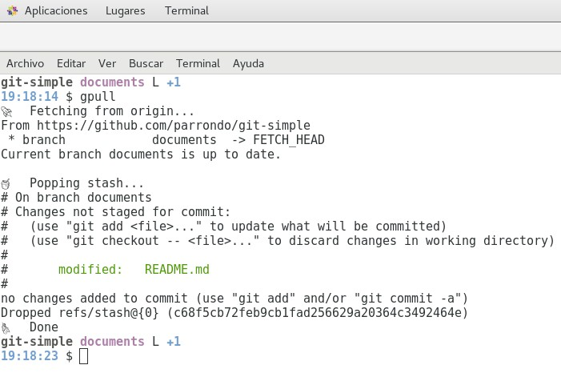

")

A collection of shell scripts for making **create**, **pulling**, **branching**, **merging**, **pushing** and **publishing** with Git fast and painless. Largely inspired by http://github.com/jamiew/git-friendly

Git sometimes requires typing two or three commands just to execute something basic like fetching new code. git-simple adds a few new commands — `gremote`, `gpull`, `gpush`, `gbranch`, `gmerge` and `gpublish` which:

* **gremote** Creates a remote Github repository from the current local directory;
* **gmerge** Tries to merge a local branch into the current branch;
* **gpush** Sends your local branch changes to the remote branch;
* **gpull** Pulls remote changes using rebase & tries to rebundle;
* **gbranch** Creates and tracks remote branches if they are available;
* **gpublish** Publish your sphinx docs on Github gh-pages;

*Less time fighting Git.*

## Install

Run this one-liner, which will download the scripts into `/usr/local/bin`:

```bash
curl -sS https://raw.githubusercontent.com/parrondo/git-simple/master/install.sh | bash
```

**Note:** If you don’t have write access to `/usr/local/bin` you’ll need to run this using `sudo`.

You can change an installation directory:

```bash
curl -sS https://raw.githubusercontent.com/parrondo/git-simple/master/install.sh | bash -s ~/friendly
```

## Manual Install

Checkout the code:

```bash
git clone git://github.com/parrondo/git-simple.git ~/dev/git-simple
```

Then update your `~/.bash_profile` or `~/.bashrc` to make git-simple available each time you launch a new terminal:

```bash
export PATH=~/dev/git-simple:$PATH
```

## Usage

You now have new awesome commands: **gremote**, **gpull**, **gpush**, **gbranch**, **gmerge**, **gpublish**:



Example session:

```bash
$ gremote
$ gpull
$ gbranch awesomeness
$ echo "BUMP" >> README
$ git commit -a -m "Righteous bump"
$ gbranch master
$ gmerge awesomeness
$ gpush
$ gpublish
```


## Commands

### `gremote`

* Creates bare remote repository;
* Initializes local repository & push to remote;

```
gremote
```

### `gpull`

* Stash any local changes;
* pull from the remote using rebase;
* update submodules;
* pop your stash;
* run `bundle install`, `npm install`, `yarn install`, `bower install` or `composer install` if there are any changes in `Gemfile`, `package.json`, etc.

```
gpull
```

### `gpush`

* Push your changes to the remote;
* copy a compare URL, like [https://github.com/parrondo/git-simple/compare/e96033...5daed4](https://github.com/parrondo/git-simple/compare/e96033...5daed4), to your clipboard (works on Mac and Linux).

Any extra arguments [arg] will be passed through to `git push`, for example `push -f`.

```
gpush [arg]
```

### `gbranch`

Switch branches or create new local branch if it doesn’t exist. Intelligently sets up remote branch tracking so you can just type `git pull` and not always `git pull origin newbranch`. If no argument specified, will list all local and remote branches. 

```
gbranch [name]
```

Supports branch deletion with `-d` or `-D` keys:

```
gbranch -d [name]
gbranch -D [name]
```

And switching to a previous branch with `-`:

```
gbranch -
```

### `gmerge`

* Merge the specified branch into the current branch;
* rebase first if the branch is local-only.

```
gmerge [name]
```

### `gpublish`

* Publish sphinx docs from <project>/docs master branch on github <project> gh-pages branch;
* It is asummed the documentation is build on "source_doc_dir" (default: "docs/_build/html").

```
gpublish (from project root)
```

## Configuration

To disable `bundle install`, `npm install`, `yarn install`, `bower install` or `composer install` for the `gpull` command use environmental variables:

* `GIT_FRIENDLY_NO_BUNDLE`: disables `bundle install`
* `GIT_FRIENDLY_NO_NPM`: disables `npm install`
* `GIT_FRIENDLY_NO_YARN`: disables `yarn install`
* `GIT_FRIENDLY_NO_BOWER`: disables `bower install`
* `GIT_FRIENDLY_NO_COMPOSER`: disables `composer install`

For example, add this line to your `~/.bash_profile` to disable `bundle install`:

```bash
export GIT_FRIENDLY_NO_BUNDLE=true
```


## Enhance Your Configs

We strongly recommend editing your global `~/.gitconfig` and adding features like ANSI color, command aliases (e.g. `git st` instead of `git status`), automatic remote tracking and more. Check out [this sample ~/.gitconfig](https://gist.github.com/668161) to get started.

We also recommend adding the current Git branch to your Terminal prompt (PS1) or you’ll quickly lose your place — here is [An informative and fancy bash prompt for Git users](https://github.com/magicmonty/bash-git-prompt).


## License

MIT license.

Fork away, do whatever. Pull requests welcome.

## Contributors

* [Parrondo](https://github.com/parrondo) ([parrondo](https://github.com/parrondo))

## References

* `git-friendly`: http://github.com/jamiew/git-friendly ([jamiew](http://github.com/jamiew/git-friendly))
* `Free Wheeling image`: https://www.ronmarks.com/catalogue/free-wheeling

